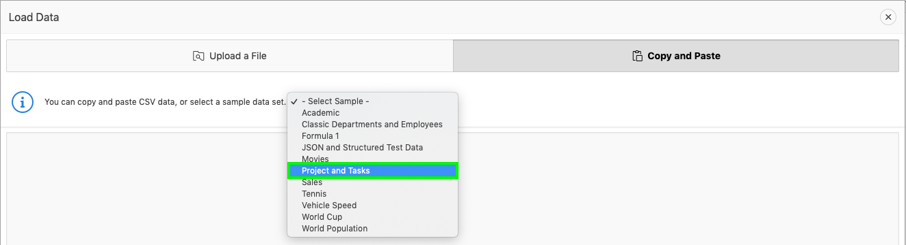

## Module 1: Building your first app - Creating an App from a Spreadsheet

### **Part 1** - Logging In

1. Log into your workspace on https://apex.oracle.com
2. Click **App Builder**.
3. Click **Create a New App**.

    

### **Part 2** - Selecting App Type

1. Click **From a File**.

    

### **Part 3** - Loading Sample Data

1. Click **Copy and Paste**.  

    
    
2. For Sample Data Set select **Projects and Tasks**.

    
    
3. Click **Next**.

### **Part 4** - Naming the Table

1. Enter Table Name **SPREADSHEET**.
2. Click **Load Data**.

    

### **Part 5** - Verifying Records Loaded

1. Check that 73 rows are loaded.
2. Click **Continue to Create Application Wizard**.

    

### **Part 6** - Naming the App

1. Enter Name **App from a Spreadsheet**.
2. Next to Features, click **Check All**.

    

### **Part 7** - Create Application

1. Click **Create Application**.

    

### **Part 8** - App in Page Designer

1. Your new application will be displayed in Page Designer.
2. Click **Run Application**.

    

### **Part 9** - Runtime App

1. Enter your user credentials.
2. Play around with your new application.

    

## Summary

To be added [Click here to navigate to Module 2](2-using-the-runtime-environment-improving-the-report-and-form.md)
