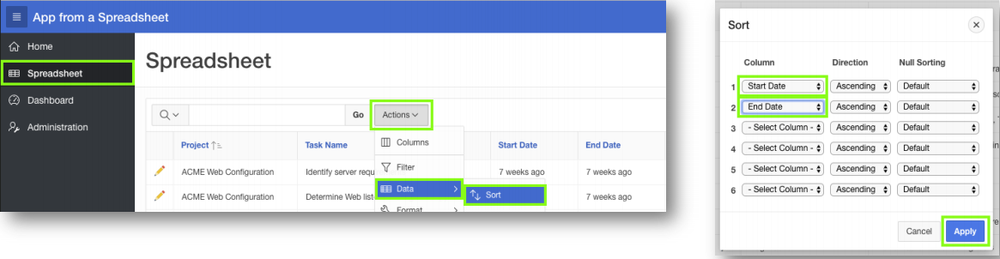

## Module 2: Using the Runtime Environment - Improving the Report and Form

### **Part 1** - Sort the Interactive Report

1. Click **Spreadsheet**.
2. Click **Actions**, select **Data**, select **Sort**.
3. For 1, select **Start Date**; For 2, select **End Date**; click **Apply**.

    

### **Part 2** - Add a Computation

1. Click **Actions**, select **Data**, select **Compute**.
2. Column Label enter **Budget V Cost**.
3. Format Mask select **$5,234.10**.
4. Computation Expression enter **I – H**.
5. Click **Apply**.

    

### **Part 3** - Add a Chart

1. Click **Actions**, select **Chart**.
2. Label select **Project**.
3. Value select ****Budget V Cost**.
4. Function select **Sum**.
5. Sort select **Label – Ascending**.
6. Orientation select **Horizontal**.
7. Click **Apply**.

    

    .PNG)

### **Part 4** - Save Report

1. Click **Actions**, select **Report**, select **Save Report**.
2. For Save, select **As Default Report Settings** .

    
3. Default Report Type, select **Alternative**.
4. Name, enter **Date Review**.
5. Click **Apply**.  

    .PNG)

### **Part 5** - Restrict the Status

1. In the Runtime environment, click the view report icon.
    
2. In the runtime environment, click the edit icon on a record.
    
3. A modal page will be displayed.
4. In the Developer Toolbar, click **Quick Edit**.

    
5. Hover over the **Status** item (until a blue outline appears) and click the mouse.
6. Page Designer displays with focus on the Status item.
7. In Page Designer, within the Property Editor (right pane), for Type select **Select List**.
8. Under List of Values, for Type select **SQL Query**.
9. Next to SQL Query, click **Code Editor**.

    .PNG)

10. Within the Code Editor, enter the following:
    ```sql
    select distinct status d, status r
    from spreadsheet
    order by 1        
    ```
11. Click **Validate**. 
    .PNG)
12. Click **OK**.  
13. Display Extra Values, select **No**.
14. Null Value Display, enter **- Select Status -**.
15. Click **Save**.(In the toolbar - top right)  
    .PNG)

### **Part 6** - Run the App

1. Navigate back to the runtime environment.
2. Refresh the browser.
3. Edit a record.
4. Click **Status**.

    

## Summary

To be added.[Click here to navigate to Module 3](3-using-the-runtime-environment-adding-a-calendar.md)
