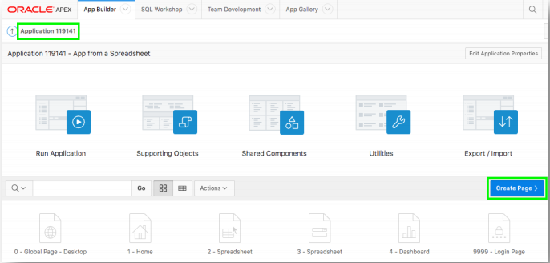

## Module 3: Using the Runtime Environment - Adding a Calendar

### **Part 1** - Add a Calendar

1. Navigate back to the development environment.
2. In App Builder, navigate to the App Home Page.
3. Click **Create Page**.

    

4. Click **Calendar**.

    .PNG)

5. Page Name, enter **Calendar**.
6. Breadcrumb, select **Breadcrumb**.
7. Click **Next**.  

    .PNG)

8. Navigation Preference, click **Create a new navigation menu entry**.
    .PNG)
9. Click **Next**.  
10. Table / View Name, select **SPREADSHEET (table)**.
11. Click **Next**.  
    .PNG)
12. Display Column, select **TASK_NAME**.
13. End Date Column, select **END_DATE**.
14. Click **Create**.  
    .PNG)

### **Part 2** – Link the Calendar to the Update Form

1. In the Rendering tab, under Calendar, click **Attributes**.
2. In the Property Editor (right pane), click **View / Edit Link**.
3. Page, select **3**.
4. Set Items – Name, select **P3_ID**; Value, select **ID**.
5. Clear Cache, enter **3**.
6. Click **OK**.
7. Click **Save and Run**.

    

    .PNG)  
    *Note: You may need to navigate to the month of May to see calendar entries.*

## Summary

To be added.

- APEX on Autonomous  https://apex.oracle.com/autonomous
- APEX Collateral  http://apex.oracle.com
- Tutorials  https://apex.oracle.com/en/learn/tutorials
- Community  http://apex.oracle.com/community
- External Site + Slack  http://apex.world
